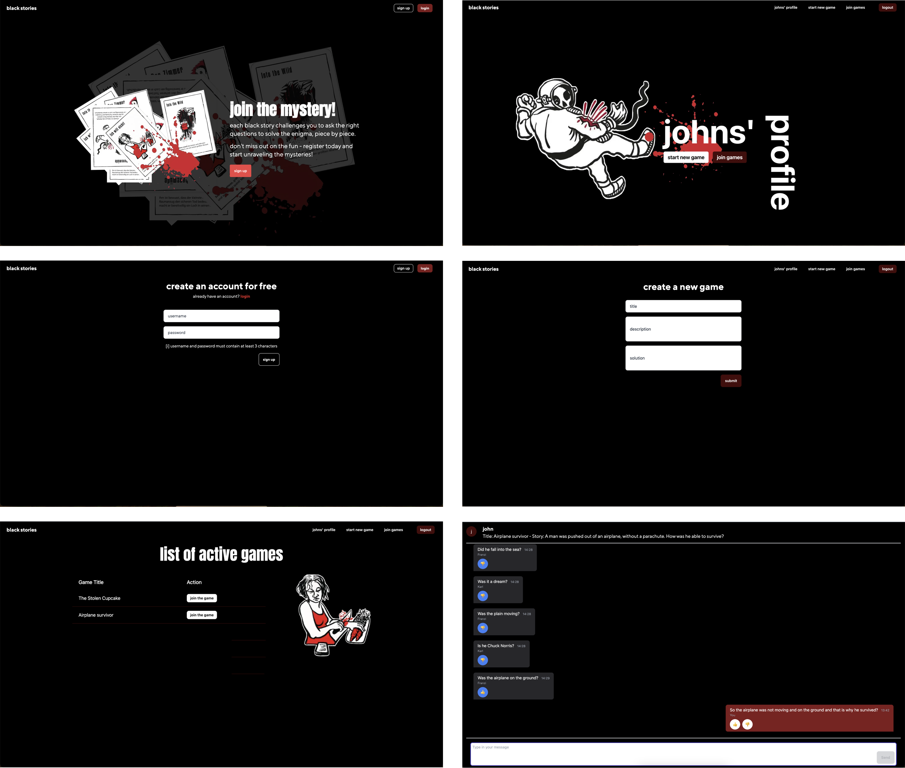

# Nextjs Final Project

## Black Stories Real-Time Chat Application

This platform allows users to connect and play with friends. In a chat room, users can solve the mystery of the Black Stories.

### Project Overview

This project showcases a variety of technologies and techniques for web development. Here's what to expect:

- **User Authentication:** Implement a registration and login system
- **Game Management** Enable users to start a new game with a story from the Black Stories game, and redirect to the chat room.
- **Real-Time Communication:** Use web sockets with Pusher to facilitate instant messaging within the chat room.
- **Interactive UI Elements:** Allow users to post messages and respond with thumbs up 👍 or thumbs down 👎 icons, simplifying yes/no answers.
- **Backend Integration:** Ensure operations with a structured backend that handles game logic, user sessions and real-time data processing.

## Technologies Used


## Screenshots



## Setup instructions

1. Clone the repository
   ```
   git clone https://github.com/cheorodio/golokal.git
   cd golokal
   ```
2. Install dependencies using
   ```
   pnpm install
   ```
3. Setup postgres database
4. Create a file called .env in the project root directory and paste the following, changing to your own username, password and database:

   ```
   PGHOST=localhost
   PGUSERNAME=<your username>
   PGPASSWORD=<your password>
   PGDATABASE=<your database name>

   PUSHER_APP_ID=<your app id>
   NEXT_PUBLIC_PUSHER_APP_KEY=<your app key>
   PUSHER_APP_SECRET=<your app secret>
   PUSHER_APP_CLUSTER=<your app cluster>
   ```

5. Then run the following queries, with a database name, username and password of your own.

   ```
   CREATE DATABASE <database name>;
   CREATE USER <user name> WITH ENCRYPTED PASSWORD '<user password>';
   GRANT ALL PRIVILEGES ON DATABASE <database name> TO <user name>;
   \connect <database name>;
   CREATE SCHEMA <user name> AUTHORIZATION <user name>;
   ```

6. Connect to postgres database and run either:

   - `psql -U <user name> <database name>` on windows and macOS
   - `sudo -u <user name> psql -U <user name> <database name>` on Linux

7. Add migration script by adding the following script to your `package.json`:

   ```
   "scripts: {
   "migrate": "ley --require tsx/cjs"
   }
   ```

8. Apply database migrations

   ```
   pnpm migrate up
   ```

9. Run application
   ```
   pnpm dev
   ```
   Open http://localhost:3000 on browser.
