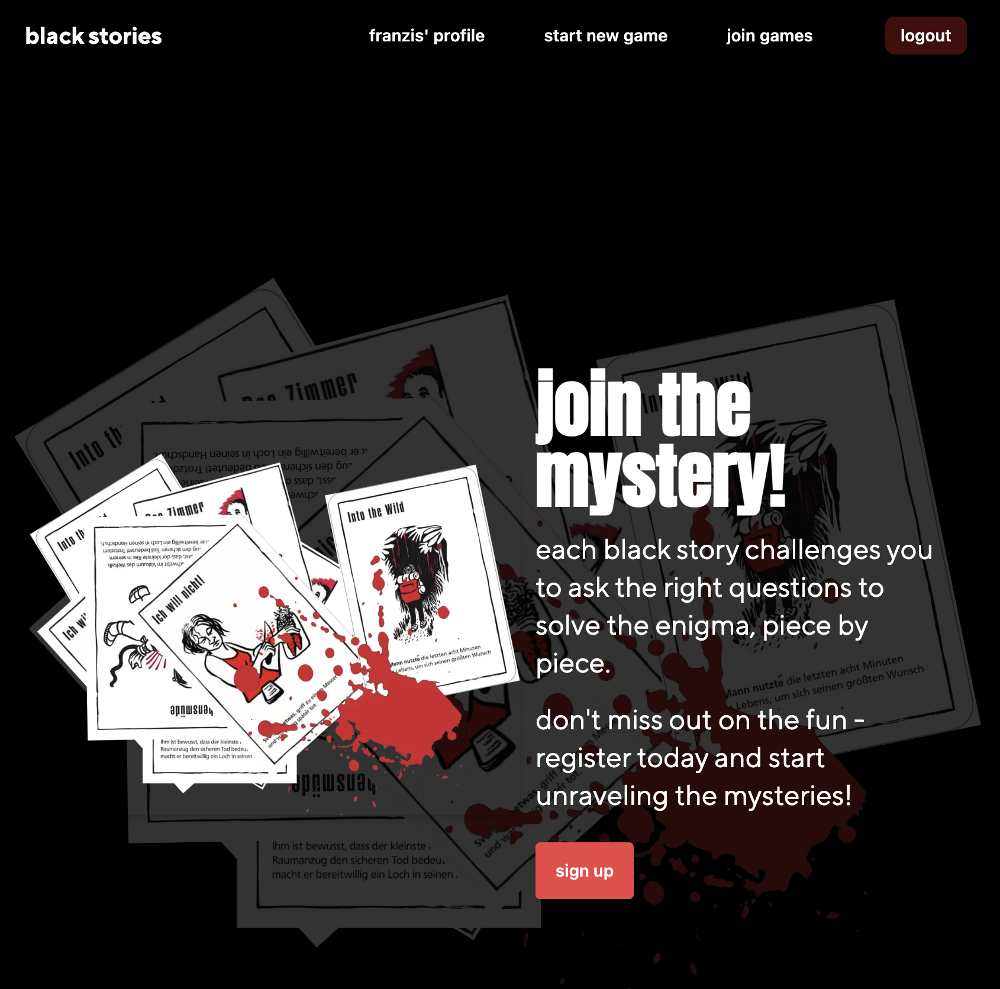

# Nextjs Final Project

## Black Stories Real-Time Chat Application

This platform allows users to connect and play with friends. In a chat room, users can solve the mystery of the Black Stories.

### Project Overview

This project showcases a variety of technologies and techniques for web development. Here's what to expect:

- **User Authentication:** Implement a registration and login system
- **Game Management** Enable users to start a new game with a story from the Black Stories game, and redirect to the chat room.
- **Real-Time Communication:** Use web sockets with Pusher to facilitate instant messaging within the chat room.
- **Interactive UI Elements:** Allow users to post messages and respond with thumbs up 👍 or thumbs down 👎 icons, simplifying yes/no answers.
- **Backend Integration:** Ensure operations with a structured backend that handles game logic, user sessions and real-time data processing.

## Technologies Used

- Next.js
- Tailwind CSS & DaisyUI: https://daisyui.com/
- PostgreSQL
- Ley
- Pusher: https://pusher.com/
- Session tokens with bcrypt for password hashing
- Docker & Fly.io: https://fly.io/

## Setup instructions

To get started with the project, follow these steps:

1. Clone the repository: `git clone [repo URL]`
2. Install dependencies: `pnpm install`
3. Setup the database:

- Download and install PostgreSQL
- Create a user and a database in PostgreSQL

4. Configure environment variables:

- Create a new file named `.env`
- Copy the environment variables from `.env-example` into `.env`
- Replace the placeholders `xxxxx` with your PostgreSQL username, password and database name

5. Add migration script by adding the following script to your `package.json`: `"scripts: {
"migrate": "ley --require tsx/cjs"
}`
6. Apply database migrations: `pnpm migrate up`
7. Start the server: `pnpm dev`
8. Open your browser and navigate to http://localhost:3000 to see the application in action

## Screenshots

